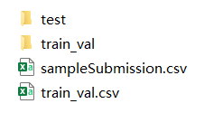

# README

- 训练模型的代码为[net_train.py](./net_train.py)和[sharp_train.py](./sharp_train.py)，这两个代码的运行只需要将数据集在data文件夹中放入下图所示网站上下载下来的数据文件：

- [test.py](./test.py)文件为得到最后预测结果的代码，运行只要将所有的测试数据放入到代码中指定的路径，并且要和model_sharp.h5和model_net.h5和[mylib](./mylib)文件夹放在同一目录下；
- 运行[test.py](./test.py)会在该目录下出现应该submission.csv文件，该文件就是提交上去有相应分数的文件
